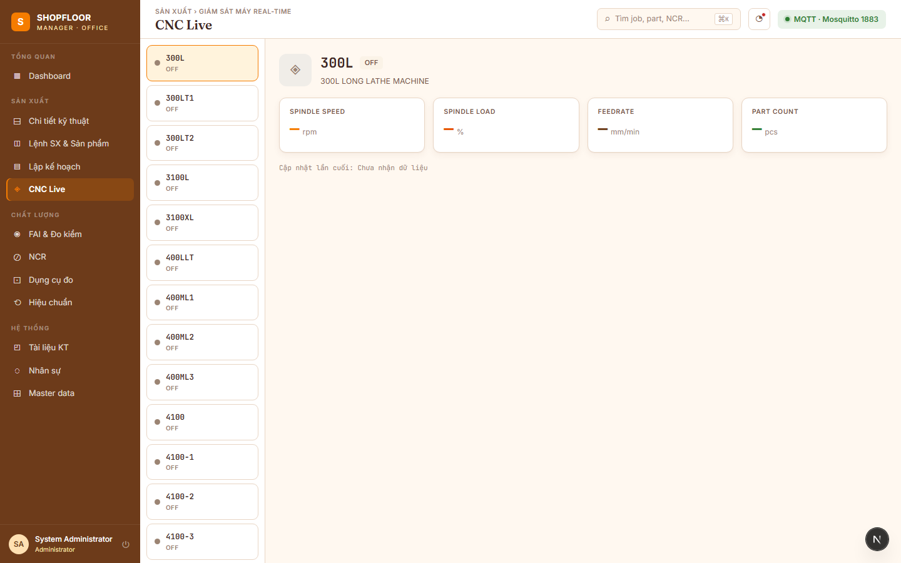
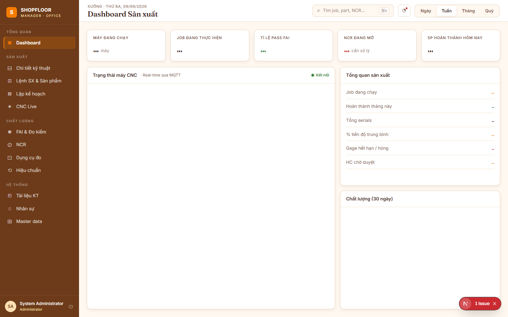
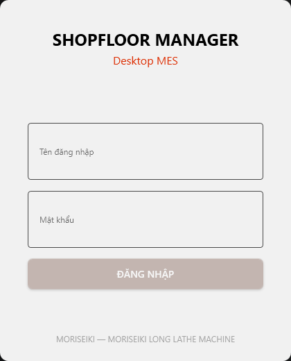
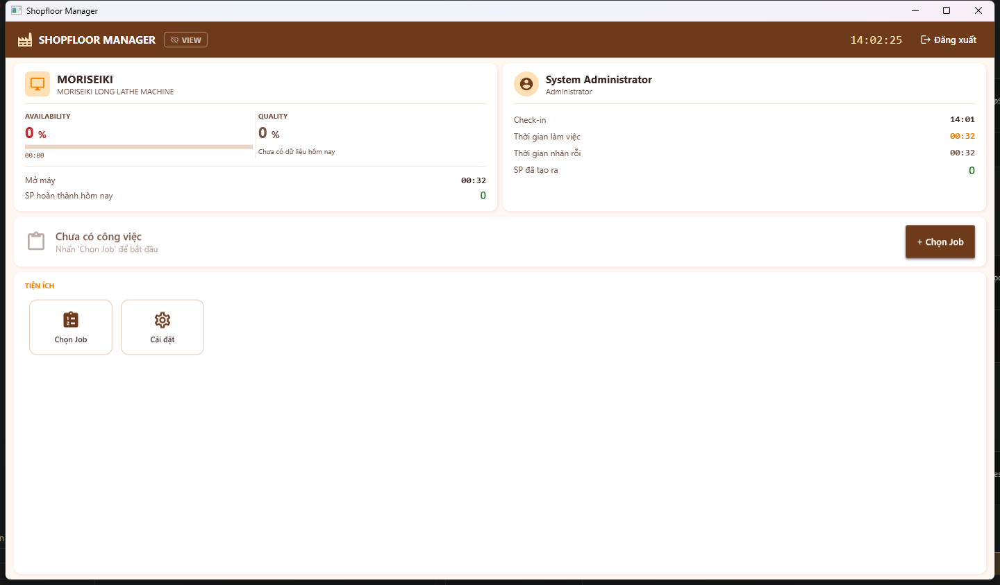
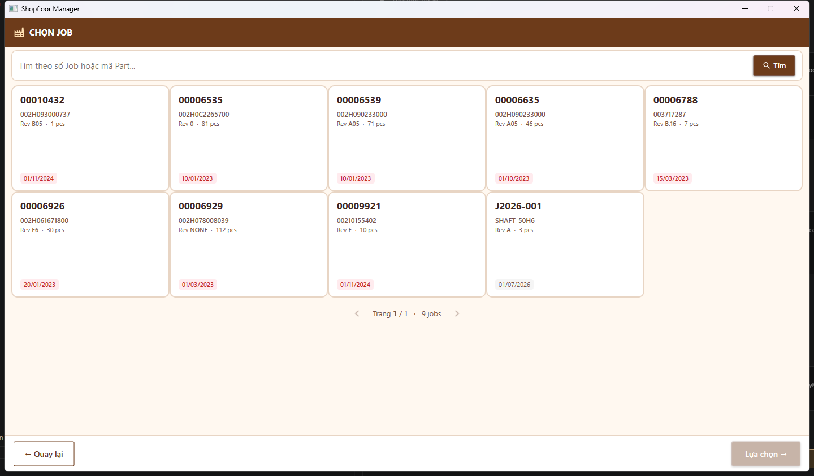

# Shopfloor Manager

**Open-source factory management system for CNC machining shops** — self-hosted, no vendor lock-in, built with .NET 9 + Next.js + PostgreSQL.

[](LICENSE)
[](https://dotnet.microsoft.com/)
[](https://nextjs.org/)
[](https://www.postgresql.org/)

Developed as a full replacement for a legacy WinForms system (ManageData + Vinam-MES) used in precision CNC machining shops of 50–200 people. All business logic lives in C#; the database stores data only (no stored procedures, no triggers).

> **UI language:** Vietnamese — the target market is Vietnamese CNC machining factories.

---

## Table of Contents

- [Introduction](#introduction)
- [Features](#features)
  - [Production Management](#production-management)
  - [Technical Documents](#technical-documents)
  - [Quality Inspection — FAI](#quality-inspection--fai)
  - [NCR — Non-Conformance Reports](#ncr--non-conformance-reports)
  - [Gage Management](#gage-management)
  - [Production Planning](#production-planning)
  - [CNC Machine Monitoring](#cnc-machine-monitoring)
  - [Dashboard](#dashboard)
  - [Desktop MES — WPF Touchscreen App](#desktop-mes--wpf-touchscreen-app)
- [System Architecture](#system-architecture)
- [Tech Stack](#tech-stack)
- [Project Structure](#project-structure)
- [Domain Model](#domain-model)
- [Core Business Rules](#core-business-rules)
- [Roles & Permissions](#roles--permissions)
- [Getting Started](#getting-started)
- [Production Deployment](#production-deployment)
- [Project Status](#project-status)
- [License](#license)

---

## Introduction

Shopfloor Manager replaces two legacy WinForms applications that were built on top of MySQL stored procedures and DevExpress controls:

| Legacy system | Replacement | Where |
|---|---|---|
| ManageData (WinForms + DevExpress) | Web App (Next.js) | Engineering office / management |
| Vinam-MES (WinForms touchscreen) | Desktop App (WPF) | At each CNC machine on the shop floor |
| MySQL stored procedures (429 total) | ASP.NET Core Application layer | Business logic 100% in C# |
| FTP server | MinIO (S3-compatible) | Technical document storage |

**Design philosophy:**

- **Self-hosted first** — one `docker compose up` runs the entire stack on an internal Linux server.
- **Solo-developer friendly** — no over-engineering; the simplest solution that works.
- **Business logic 100% in the API** — the database stores data only. No stored procedures, no triggers.
- **All MIT/Apache 2.0 dependencies** — no commercial library lock-in.
- **Audit trail everywhere** — every record carries `created_by`, `updated_by`, `created_at`, `updated_at`.

---

## Features

### Production Management

Manage production orders (Jobs), part definitions (Parts/Revisions), manufacturing routings, and individual product serials.


**Jobs (`/jobs`)** — master-detail view: job list on the left, job details (part, revision, routing, progress bar, serial grid) on the right. Each job tracks progress per serial (0/N completed) and flags overdue orders.


**Parts (`/parts` — "Chi tiết kỹ thuật")** — part catalog with revision history, routing revisions, and the full operation sequence (OP10 → OP20 → ... → Final Inspection). Each operation shows its type (CNC Machining, Turning, Heat Treatment, etc.), setup time, run time, and linked technical documents.

**Key concepts:**

- A **Part** has multiple **Revisions** (Rev A, B, C…). A revision change creates a new record — old data is never overwritten.
- A **Routing** defines the process steps for a given PartRev. Routing changes create a new **RoutingRev**, copying all operations forward.
- A **Job** stores a snapshot of both `PartRevId` and `RoutingRevId` at creation time — subsequent routing changes do not affect jobs already in production.
- **Product** serials (001, 002, … N) are auto-generated when a Job is created. Each serial is the unit of measurement tracking.

---

### Technical Documents

Upload, version, and approve technical documents per part or per operation.

Eight document types are supported, each with its own MinIO storage path:

| Type | Description | Level |
|---|---|---|
| `DRW` | 2D Drawing | Part/Revision |
| `CAD` | 3D CAD file | Part/Revision |
| `GCD` | G-code program | Operation |
| `TLS` | Tool list | Operation |
| `CAM` | CAM file | Operation |
| `THD` | Thread inspection sheet | Operation |
| `RTC` | Route card (job-specific) | Job Operation |
| `FXT` | Fixture drawing (job-specific) | Job Operation |

**Approval workflow (3 upload rules):**

1. `BLOCK` if status = `Approved` → file is locked; even the uploader cannot overwrite.
2. `BLOCK` if status = `Pending` and `CreatedBy ≠ current user` → another person is awaiting approval.
3. `ALLOW` if status = `Rejected` → renames old file to `Rejected_{filename}` on MinIO, uploads new file, resets status to `Pending`.

Documents are uploaded directly to MinIO via pre-signed URL; the API manages metadata only.

---

### Quality Inspection — FAI

Define dimension sheets per operation and record measurement results per product serial.

Each **Dimension** belongs to a specific **PartOp** and carries:
- `BalloonNumber` — the balloon label on the drawing (e.g. `"Ø1"`, `"L2"`, `"Ra3"`)
- `Nominal`, `TolerancePlus`, `ToleranceMinus` — stored as `DECIMAL(14,4)`, never as text
- `IsTextType` — for thread callouts and geometric symbols (Pass/Fail instead of numeric)
- `DimensionCategory` — `LIN`, `ANG`, `THD`, `GEO`, or `SFC` (determines which gage types are valid)
- `IsFinal` — marks dimensions checked after all rework; only QC Inspectors may enter these values

**SPC** — `MathNet.Numerics` calculates Cpk/Cp from measurement history per dimension.

Measurement entry happens both in the Web App (office QC) and the Desktop MES (at the machine).

---

### NCR — Non-Conformance Reports


Track and resolve non-conforming parts from initial report through disposition.

- Auto-generated number format: `NCR-{YY}-{NNNN}` (e.g. `NCR-26-0005`)
- Linked to: Job, serial number, PartOp
- Categorized by reason (Tool wear, Setup error, Drawing error, Material defect, …) and department (PROD, QC, ENG)
- **Disposition workflow**: `Pending` → `Approve` (accept as-is) / `Rework` (send back) / `Reject` (scrap)
- Full audit log: every status change is recorded with timestamp and user

NCRs can be created from the Desktop MES directly at the machine after a failed FAI measurement, or from the Web App office interface.

---

### Gage Management


Manage the metrology equipment inventory: calipers, micrometers, bore gauges, CMM probes, thread gauges, and more.

- **Borrow / Return** — log who borrowed which gage and when; overdue borrows are highlighted.
- **Calibration due dates** — automatic warnings when a gage's calibration expires.
- **Gage types** aligned to dimension categories: `CAL`, `MIC`, `BOR`, `DPG`, `HEG` (Linear); `PLG`, `PDG` (Thread); `CMM`, `IND`, `PPM` (Geometric); `SRM` (Surface).

---

### Production Planning


Weekly Gantt chart view per machine: visualize job scheduling, identify conflicts, and track shift loading. (Phase 5 — API integration in progress.)

---

### CNC Machine Monitoring



Real-time machine status collected via **MQTT** (Mosquitto broker). The API subscribes to `factory/cnc/{machineCode}/status` topics and pushes updates to the Web App via **SignalR**.

Supports FANUC FOCAS and MTConnect adapters (publishes to the same MQTT topic schema).

---

### Dashboard



Role-aware KPI overview combining:
- **Machine status panel** — live CNC availability via MQTT/SignalR
- **Production summary** — jobs running, serials completed today, average progress
- **Quality panel** — FAI pass rate (30-day), open NCRs needing action
- **Gage alerts** — calibration expiring / overdue borrows
- **Documents** — pending approval queue

Time filters: Day / Week / Month / Quarter.

---

### Desktop MES — WPF Touchscreen App

A separate WPF application (`ShopfloorManager.Desktop`) installed on each CNC machine PC. Designed for 10–15" touchscreens; all buttons are ≥56px tall.

**Login**



Per-machine configuration in `local.json`: `ApiBaseUrl`, `MachineCode`, `MachineName`. The app connects to the shared API — no direct database access.

**Dashboard**



The main screen after login shows:
- **Machine card** (top-left) — availability %, quality %, uptime, parts made today
- **Operator card** (top-right) — check-in time, work time, idle time, parts produced
- **Work Info card** (center) — current Job / OP / Serial with Start / Stop / Navigate buttons
- **Shortcuts** (bottom) — contextual quick-access to Select Job, Select OP, FAI Sheet, G-code Viewer, NCR, Settings

**Job Selection**



Card-grid job browser (5 per row) with overdue highlighting (red date badge). Touch-optimized — swipe to scroll, large touch targets.

**Operation → Product → FAI workflow:**

1. Operator selects **Job** → **Operation** → **Product serial**
2. Presses **Start** → creates a `ProductionSession` (API records timestamp)
3. Opens **FAI Sheet** — dimension card grid (balloon numbers, nominal, tolerances)
4. Taps a dimension card → virtual **NumPad** appears (for numeric) or **PASS/FAIL** buttons (for text type)
5. Confirms measurement → auto-advances to next unmeasured dimension
6. When all dimensions measured → presses **Stop** → session closed
7. Any FAIL → **NCR dialog** opens immediately at the machine

**Document Viewer:**
- G-code files rendered with syntax highlighting (N/G/M/axis/feed/tool in different colors) inside a `RichTextBox`
- PDF files (drawings, route cards) rendered natively via **WebView2** (Edge PDF viewer)

**Session rules:**
- Only one active session per machine at a time
- `Leader` and `Administrator` roles can force-finish another operator's session
- Other users login during an active session → View Mode (read-only browse, no production input)

---

## System Architecture

```
┌──────────────────────────────────────────────────────────────────┐
│  Web App  (Next.js 16 — clients/web)                             │
│  Office UI: Engineering · Management · QC · Planning             │
│  Routes: /jobs  /parts  /ncrs  /gages  /planning  /cnc  /fai    │
│  → Accessible from any PC or tablet via browser                  │
└───────────────────────────┬──────────────────────────────────────┘
                            │ REST API (JSON) + SignalR (WebSocket)
┌───────────────────────────▼──────────────────────────────────────┐
│  ASP.NET Core Web API (.NET 9) — src/ShopfloorManager.API        │
│  Clean Architecture · MediatR · FluentValidation · JWT Auth      │
│  Business logic 100% here — no stored procedures                 │
└───┬───────────────────┬──────────────────┬────────────────────────┘
    │                   │                  │
PostgreSQL 16        MinIO              SignalR Hub
(data only)       (tech docs,         (real-time push
                   drawings,           to Web + Desktop)
                   G-code, PDF)              │
                                 ┌───────────▼──────────────────────┐
                                 │  Desktop App (WPF .NET 9)        │
                                 │  src/ShopfloorManager.Desktop    │
                                 │  Touchscreen MES at CNC machine  │
                                 │  FAI · NCR · G-code · PDF viewer │
                                 └───────────────┬──────────────────┘
                                                 │ MQTT
                                 ┌───────────────▼──────────────────┐
                                 │  Mosquitto MQTT Broker            │
                                 │  CNC data: FANUC / MTConnect      │
                                 └──────────────────────────────────┘
```

**Request flow (Web/Desktop → API):**

```
HTTP Request
  → Controller (thin — delegates to IMediator.Send)
  → MediatR Handler (all business logic lives here)
  → Repository / Service interfaces (Application layer)
  → EF Core / MinIO / SignalR / MQTT
```

---

## Tech Stack

### Backend (.NET 9)

| Component | Technology | License |
|---|---|---|
| API framework | ASP.NET Core Web API .NET 9 | MIT |
| ORM | Entity Framework Core 9 | MIT |
| CQRS/Mediator | MediatR | MIT |
| Validation | FluentValidation | Apache 2.0 |
| Database | PostgreSQL 16 | PostgreSQL |
| File storage | MinIO (S3-compatible) | AGPL v3 |
| Authentication | JWT Bearer | MIT |
| Real-time | SignalR | MIT |
| MQTT client | MQTTnet | MIT |
| Excel export | ClosedXML | MIT |
| PDF reports | QuestPDF | MIT |
| SPC / math | MathNet.Numerics | MIT |
| Email | MailKit | MIT |
| Container | Docker + Docker Compose | Apache 2.0 |

### Web Client (Next.js 16)

| Component | Technology |
|---|---|
| Framework | Next.js 16 (App Router) + TypeScript |
| UI primitives | @base-ui/react + shadcn/ui CLI |
| Styling | Tailwind CSS v4 |
| Server state | TanStack Query v5 |
| Client state | Zustand |
| Forms | React Hook Form + Zod |
| Charts | Apache ECharts (Phase 5) |
| Gantt | Frappe Gantt (Phase 5) |

### Desktop Client (WPF .NET 9)

| Component | Technology |
|---|---|
| Framework | WPF .NET 9 (Windows only) |
| UI components | MaterialDesignThemes |
| MVVM | CommunityToolkit.Mvvm |
| PDF viewer | Microsoft.Web.WebView2 |
| Virtual keyboard | Custom WPF (NumPad + QWERTY) |
| HTTP client | System.Net.Http.HttpClient + JWT |

---

## Project Structure

```
shopfloor-manager/
├── src/                                    # .NET 9 Solution
│   ├── ShopfloorManager.API/               # Controllers, middleware, DI composition root
│   │   └── Controllers/                    # Thin controllers — IMediator.Send only
│   ├── ShopfloorManager.Application/       # MediatR handlers, FluentValidation, DTOs
│   │   ├── Commands/                       # Write operations
│   │   └── Queries/                        # Read operations
│   ├── ShopfloorManager.Domain/            # Entities, enums — no framework dependencies
│   ├── ShopfloorManager.Infrastructure/    # EF Core DbContext, MinIO, MQTT, MailKit
│   │   └── Migrations/                     # EF Core migrations
│   ├── ShopfloorManager.Shared/            # PagedResult<T>, AppConstants, enums
│   └── ShopfloorManager.Desktop/           # WPF touchscreen MES app
│       ├── Pages/                          # Dashboard, JobList, OperationList, FAI, …
│       ├── ViewModels/                     # CommunityToolkit.Mvvm ObservableObject
│       ├── Services/                       # IApiClient, IAuthService, IKeyboardService
│       ├── Controls/                       # Virtual keyboard windows
│       └── local.json                      # Per-machine config (gitignored)
│
├── clients/
│   └── web/                                # Next.js 16 Web App
│       ├── app/
│       │   ├── (auth)/login/               # Login page
│       │   └── (main)/                     # Authenticated shell (sidebar + topbar)
│       │       ├── dashboard/
│       │       ├── jobs/[id]/
│       │       ├── parts/[id]/
│       │       ├── ncrs/
│       │       ├── gages/
│       │       ├── planning/
│       │       ├── cnc/
│       │       └── master/
│       ├── components/
│       │   └── va/                         # VA design system components
│       │       ├── sidebar.tsx             # VASidebar — 224px brown, nav groups
│       │       ├── topbar.tsx              # VATopbar — breadcrumb + serif title
│       │       ├── badge.tsx               # VABadge (ok/warn/err/neutral/primary)
│       │       ├── kpi.tsx                 # VAKpi card with trend indicator
│       │       └── btn.tsx                 # VABtn (primary/accent/ghost)
│       └── lib/
│           └── api-client.ts               # Typed fetch wrapper with JWT
│
├── docs/
│   └── screenshots/                        # UI screenshots for this README
│
├── docker-compose.yml                      # Production stack
├── docker-compose.dev.yml                  # Dev: PostgreSQL + MinIO + Mosquitto only
└── Project_Documents/                      # Business logic specs (Vietnamese)
    ├── 01_auth.md
    ├── 03_job_management.md
    ├── 06_dimensions_fai.md
    └── …
```

---

## Domain Model

The production core revolves around the following entity hierarchy:

```
PartNumber  (part catalog)
  └── PartRev  (design revision: Rev A, B, C…)
        ├── TechDocument  (DRW, CAD — part-level files)
        └── Routing  (manufacturing process definition)
              └── RoutingRev  (process revision: R1, R2…)
                    └── PartOp  (operation: OP10, OP20, OP30…)
                          ├── TechDocument  (GCD, TLS, CAM, THD — op-level files)
                          └── Dimension  (dimension to inspect)
                                └── MeasureValue  (actual measured result)

Job  (production order)
  ├── PartRevId    ─── snapshot of PartRev at order creation
  ├── RoutingRevId ─── snapshot of RoutingRev at order creation
  └── Product  (serial: 001, 002, … RunQty)
        └── MeasureValue  (measured value per dimension per serial)

ProductionSession  (machine session at CNC)
  ├── ProductId
  ├── PartOpId
  ├── MachineCode
  ├── StartedAt
  └── CompletedAt
```

### Key entity design decisions

| Decision | Rationale |
|---|---|
| `Job` stores `PartRevId` + `RoutingRevId` snapshot | Routing changes after job creation must not affect in-progress jobs |
| No OP copying into Job | Operations are queried dynamically from `RoutingRevId`; job-specific OPs use `ForJobOnly = true` |
| `Dimension` values in `DECIMAL(14,4)` | Legacy system stored tolerances as `VARCHAR`, causing silent precision loss |
| `MeasureValue` — new record per measurement | Preserves full measurement history; upsert would lose rework traceability |
| Soft delete via `deleted_at TIMESTAMPTZ` | Major entities (Parts, Jobs, Users) are never hard-deleted |
| `snake_case` table/column names | PostgreSQL convention; consistent with EF Core `UseSnakeCaseNamingConvention()` |
| All business logic in Application layer | Zero stored procedures; enables unit testing without a database |

---

## Core Business Rules

### Parts & Routing

- `(part_number, revision)` must be **unique** — a revision change creates a new PartRev record.
- Creating a new **RoutingRev**: deactivates the current rev and copies all `PartOps` forward. Engineers edit on the new rev only.
- Only one `RoutingRev` per `Routing` can have `IsActive = true` at a time.

### Jobs

- `job_number` is a business key (e.g. `J2026-001`) — set by the engineer, not auto-generated.
- Creating a job auto-generates `Product` serials from `001` to `RunQty`.
- A job's routing = `PartOps WHERE RoutingRevId = job.RoutingRevId` UNION `PartOps WHERE JobId = job.Id AND ForJobOnly = true`.

### Dimensions & FAI

- `BalloonNumber` must be unique within a `PartOp`.
- `Pass` when `Nominal − ToleranceMinus ≤ MeasuredValue ≤ Nominal + TolerancePlus`.
- `IsTextType = true` → operator selects Pass/Fail manually; no numeric bounds.
- `IsFinal = true` → only `QC Inspector` role may enter the value; Operators see it but it is disabled.

### Technical Documents

1. `Approved` → **locked**. No overwrite, even by the original uploader.
2. `Pending` + `CreatedBy ≠ currentUser` → **blocked**. Must wait for the current reviewer to act.
3. `Rejected` → **allowed**. Old file renamed `Rejected_{filename}` on MinIO; new upload resets to `Pending`.

### NCR

- Format: `NCR-{YY}-{NNNN}` — year-sequential, never recycled.
- Disposition: `Pending → Approved` (use as-is), `Pending → Rework` (return for correction), `Pending → Rejected` (scrap).
- NCR closes automatically when all rework is verified and a final FAI passes.

### Production Sessions (Desktop MES)

- **One active session per machine** — a new session is blocked if the machine already has one with `started_at IS NOT NULL`.
- **One active session per product** — a product being worked on at another machine is blocked.
- `Leader` and `Administrator` can force-complete another operator's session.
- Other roles logging in while a session is active → **View Mode** (read-only; no input allowed).

---

## Roles & Permissions

| Role | Description | Key permissions |
|---|---|---|
| `Administrator` | System admin | All permissions + Settings page on Desktop |
| `Manager` | Factory manager | View all data, approve NCRs, manage users |
| `Engineer` | Process engineer | Create/edit Parts, Routings, Dimensions, upload documents |
| `QC Inspector` | Quality inspector | Approve/reject TechDocs, enter FAI finals, close NCRs |
| `Operator` | CNC machine operator | Desktop MES: select Job/OP/Serial, enter measurements, file NCRs |
| `Leader` | Team leader | Operator permissions + force-finish other sessions |
| `Planner` | Production planner | View all production data, manage planning/Gantt |

---

## Getting Started

**Prerequisites:** Docker Desktop, .NET 9 SDK, Node.js 20+

```bash
# 1. Clone the repository
git clone https://github.com/longnvht/shopfloor-manager.git
cd shopfloor-manager

# 2. Start infrastructure (PostgreSQL, MinIO, Mosquitto)
docker compose -f docker-compose.dev.yml up -d

# 3. Run the API (from repo root)
cd src
dotnet run --project ShopfloorManager.API
# → http://localhost:5066
# → Swagger UI: http://localhost:5066/swagger
```

```bash
# 4. Run the Web App
cd clients/web
npm install
npm run dev
# → http://localhost:3000
```

**Default credentials** (dev only — no `.env` required):

| Service | URL | Credentials |
|---|---|---|
| Web App | `http://localhost:3000` | `admin` / `Admin@123` |
| API Swagger | `http://localhost:5066/swagger` | — |
| PostgreSQL | `localhost:5432` | `shopfloor` / `dev_password` / `shopfloor_dev` |
| MinIO Console | `http://localhost:9001` | `minioadmin` / `minioadmin123` |
| MQTT | `localhost:1883` | no auth |

**EF Core migrations** (required after any entity change):

```bash
cd src
dotnet ef migrations add {MigrationName} \
  --project ShopfloorManager.Infrastructure \
  --startup-project ShopfloorManager.API

dotnet ef database update \
  --project ShopfloorManager.Infrastructure \
  --startup-project ShopfloorManager.API
```

**Desktop App** (Windows only):

```bash
cd src
dotnet build ShopfloorManager.Desktop
# Edit local.json: ApiBaseUrl, MachineCode, MachineName
dotnet run --project ShopfloorManager.Desktop
```

---

## Production Deployment

```bash
# 1. Copy and configure environment
cp .env.example .env
# Edit .env: DB password, MinIO credentials, JWT secret, SMTP settings

# 2. Start the full stack
docker compose up -d
```

Nginx routes:

| Path | Service |
|---|---|
| `shopfloor.factory.local` | Web App (Next.js) |
| `shopfloor.factory.local/api/*` | REST API |
| `shopfloor.factory.local/hub/*` | SignalR |

Desktop App deployment: build with `dotnet publish`, distribute the output folder to each CNC machine PC. Edit `local.json` per machine (API URL, machine code, machine name).

> **Note:** `clients/web/Dockerfile` is not yet created — needed before deploying the web service via Docker Compose.

---

## Project Status

| Phase | Scope | Status |
|---|---|---|
| **Phase 0** | Foundation: Docker, PostgreSQL schema, .NET Clean Architecture scaffold | ✅ Done |
| **Phase 1** | Auth & HR: JWT, 7 roles, users, departments, SignalR hub | ✅ Done |
| **Phase 2** | Production Core: Parts, Jobs, Routing, Operations, TechDocuments, MinIO | ✅ Done |
| **Phase 3** | Quality: Dimensions, FAI measurements, NCR, SPC (Cpk/Cp) | ✅ Done |
| **Phase 4** | Desktop MES: WPF touchscreen app, FAI at machine, ProductionSession, SignalR | ✅ Done |
| **Web UI** | VA design system + 18 routes, real API on /jobs /parts /ncrs | ✅ Done |
| **Phase 5** | Gage & Calibration API, Planning (Gantt), MQTT pipeline, Dashboard KPIs | ⏳ Planned |
| **Phase 6** | Multi-factory, MySQL→PostgreSQL migration tool, Docker polish, docs site | ⏳ Planned |

---

## License

[MIT License](LICENSE) — all dependencies are MIT or Apache 2.0. No commercial library dependencies.

---

*Built with [Claude Code](https://claude.ai/code)*
