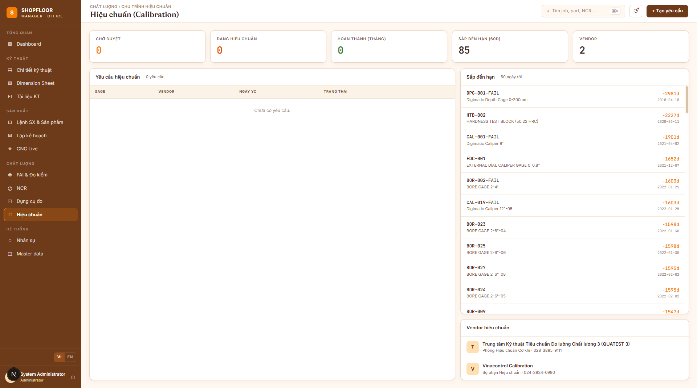

# Calibration Management

**Route:** `/calibration`  
**Roles:** All authenticated users (create requests: QC Inspector; complete: QC Inspector, Manager)

---

## Overview

Manages the calibration lifecycle for metrology gages — from identifying overdue instruments to submitting them to a calibration vendor and recording results.



---

## Workflow

```
Gage DueDate approaching
        │
        ▼
   [QC Inspector creates CalibRequest]
        │
        ▼
   Status: Pending ──► Approved ──► Completed
                          │
                  (send gage to vendor)
                          │
                   Record CalibRecord
                   (vendor cert + new date)
                          │
                   Gage DueDate updated
```

---

## Calibration Due List

Shows all gages with calibration due within the configured threshold (default: 30 days) or already overdue.

| Column | Notes |
|---|---|
| Gage code | Asset identifier |
| Gage name | Description |
| Type | Gage type |
| Due date | Computed from `LastCalibration + FrequencyDays` |
| Days remaining | Red when overdue |
| Status | `Expiring` / `Overdue` |

---

## Calibration Requests

**Create request:** Select a gage from the due list → choose a `CalibVendor` and `CalibProcedure` → submit.

`CalibRequest` statuses:
| Status | Meaning |
|---|---|
| `Pending` | Submitted, awaiting approval |
| `Approved` | Approved — gage sent to vendor |
| `Completed` | Vendor returned calibration certificate |
| `Cancelled` | Request cancelled |

**Complete a request:** Enter the calibration result:
- Calibration date
- Next due date
- Certificate number
- Notes

This creates a `CalibRecord` and updates `Gage.LastCalibrationDate` and `Gage.CalibFrequencyDays`.

---

## Reference Data

**Calibration Vendors** — external labs or internal metrology department:
- Vendor name + contact
- Accreditation standard (e.g. ISO 17025)

**Calibration Procedures** — internal SOPs:
- Procedure code + description
- Applicable gage types

---

## API Endpoints

| Method | Path | Description |
|---|---|---|
| `GET` | `/api/v1/gages/calib-due` | Gages needing calibration |
| `GET` | `/api/v1/calib-vendors` | Vendor list |
| `POST` | `/api/v1/calib-vendors` | Create vendor |
| `GET` | `/api/v1/calib-requests` | Request list |
| `POST` | `/api/v1/calib-requests` | Create request |
| `PUT` | `/api/v1/calib-requests/{id}/approve` | Approve request |
| `POST` | `/api/v1/calib-records` | Record completion + update gage |
