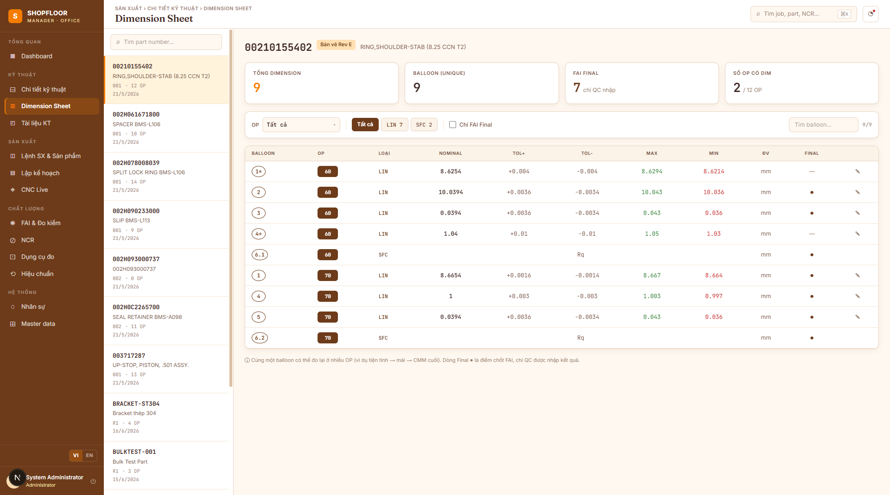

# Dimension Sheet

**Route:** `/dimsheet`  
**Roles:** All authenticated users (inline edit: Engineer, Manager)

---

## Overview

The Dimension Sheet gives a bird's-eye view of **all inspection dimensions** for a part across its entire routing — in one paginated table, without navigating into individual operations.

---

## Layout

### Left panel — Part list
- Searchable list of all parts
- Shows revision code, OP count, and creation date
- Click a part to load its dimension sheet

### Right panel — Dimension sheet

**Header:**
- Part number (large monospace) + **"Drawing Rev {code}"** badge (active `PartRev`)
- Part description

**KPI strip (4 cards):**
| KPI | Value |
|---|---|
| Total Dimensions | All dimensions in active `RoutingRev` |
| Unique Balloons | Distinct `BalloonNumber` values |
| FAI Final | Dimensions with `IsFinal = true` |
| OPs with Dims | `{ops with ≥1 dim} / {total ops}` |

**Filter bar:**
| Filter | Options |
|---|---|
| OP | Dropdown (type-to-search) — filter by operation |
| Category | Chip selector: `LIN` · `ANG` · `THD` · `GEO` · `SFC` (with dim count per category) |
| FAI Final only | Checkbox |
| Search balloon | Text input |
| Counter | `{filtered} / {total}` |

---

## Dimension Table

| Column | Notes |
|---|---|
| **OP** | Orange badge with OP number |
| **Balloon** | Circle badge — red border if `IsCritical = true` |
| **Category** | Color-coded: LIN=brown, ANG=orange, THD=tan, GEO=dark brown, SFC=medium brown |
| **Nominal** | `DECIMAL(14,4)` |
| **Tol +** | Prefixed `+` |
| **Tol −** | Prefixed `−` |
| **Max** | Green text — `Nominal + TolerancePlus` |
| **Min** | Red text — `Nominal − ToleranceMinus` |
| **Unit** | `mm` (default) |
| **Final** | `●` if `IsFinal = true`, otherwise `—` |
| **✎** | Open inline edit |

`IsTextType = true` dimensions span 5 columns showing `NominalText` instead of numeric fields.

---

## Inline Editing

Click **✎** on any numeric dimension row to edit in place:
1. Three inputs appear: **Nominal**, **Tol +**, **Tol −**
2. **Max** and **Min** preview update in real time: `Max = Nominal + Tol+`, `Min = Nominal - Tol-`
3. Click **✓** to save (`PUT /api/v1/dimensions/{id}`) or **✕** to cancel

Text-type dimensions (`IsTextType = true`) cannot be edited here — they have no numeric bounds.

---

## Empty States

| State | Shown when |
|---|---|
| No routing active | Part exists but has no active `RoutingRev` |
| No dimensions | `RoutingRev` has OPs but none have dimensions yet |
| No match | Filter combination returns 0 results |

---

## Footnote

> A balloon number may appear in multiple operations (e.g. checked at both OP 10 and OP 30). The **Final** marker is the authoritative QC gate — only QC Inspectors may enter `IsFinal` measurements.

---

## API Endpoints

| Method | Path | Description |
|---|---|---|
| `GET` | `/api/v1/routing-revs/{id}/dimensions` | All dimensions for a `RoutingRev` — used by this view |
| `PUT` | `/api/v1/dimensions/{id}` | Update Nominal + tolerances |
