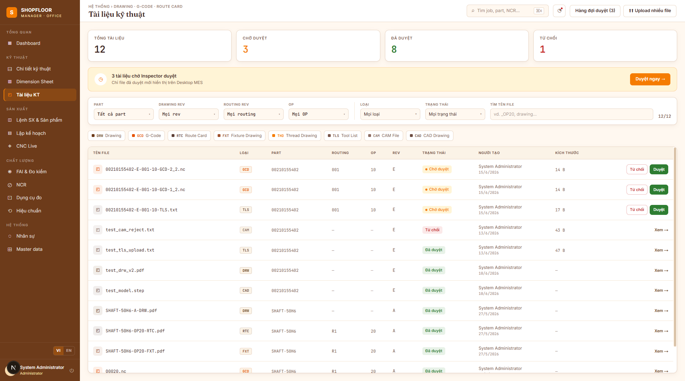
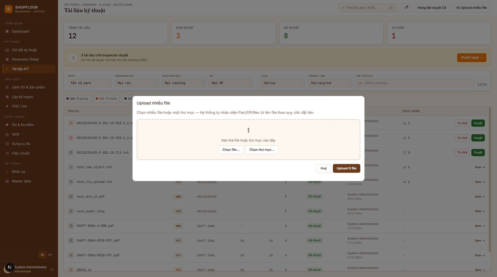

# Technical Documents

**Route:** `/documents`  
**Roles:** All authenticated users (upload: Engineer, Manager; approve: **Lead Engineer**, Manager, Administrator)

---

## Overview

Central repository for all technical files associated with parts and production jobs. Supports 8 document types across 3 ownership levels with a strict **3-rule approval workflow**.

---

## Layout

Two-panel layout: **Part list (280px)** on the left + **document list** on the right.

### Left panel — Part list
- Search box (sticky, type-to-filter by part number)
- "All parts" row shows total doc count
- Each part item: `partNumber` (mono bold), `description`, routing code + OP count, creation date
- Selecting a part pre-sets the Part filter; KPI strip + table update reactively
- Pagination when total parts > 20

### KPI Strip (4 cards) — reacts to selected part
| KPI | Value |
|---|---|
| **Total** | Documents matching current filter (not all-time total) |
| **Pending** | Awaiting approval |
| **Approved** | Approved and available to operators |
| **Rejected** | Rejected |

An **orange banner** appears when there are pending documents (within the current filter), with a direct link to the approval queue.

---

## Filter Bar

All 6 filters are **type-to-search comboboxes** (no scrolling through long lists):

| Filter | Options |
|---|---|
| **Part** | All parts — search by number or name |
| **Drawing Rev** | Revisions of the selected part |
| **Routing Rev** | Routing revisions |
| **Operation** | Operations in the selected routing |
| **Type** | DRW / GCD / RTC / FXT / THD / TLS / CAM / CAD |
| **Status** | Pending / Approved / Rejected |

Plus a free-text **filename search** and a **"✕ Clear filters"** button. A counter shows `{filtered} / {total}`.

**Type legend chips** at the top let you click once to filter by document type — click again to clear.

---

## Document Table

| Column | Notes |
|---|---|
| File name | Clickable → **"View →"** opens the file via pre-signed MinIO URL |
| Type | Color-coded badge (DRW / GCD / …) |
| Part | Part number |
| Routing | Routing revision code |
| OP | Operation number |
| Revision | Part revision code |
| Status | `Pending` / `Approved` / `Rejected` badge |
| Created by | Uploader name + date (locale-aware: `vi-VN` or `en-US`) |
| Size | `B` / `KB` / `MB` — `—` for documents uploaded before file-size tracking |
| Actions | **Approve** / **Reject** (Lead Engineer / Manager / Administrator only) |

---

## Document Types

| Code | Level | Description | MinIO path |
|---|---|---|---|
| `DRW` | Part/Rev | 2D Drawing | `drawings/{part}/{rev}/{file}` |
| `CAD` | Part/Rev | 3D CAD file | `cad/{part}/{rev}/{file}` |
| `GCD` | OP | G-code program | `gcodes/{part}/{op}/{rev}/{file}` |
| `TLS` | OP | Tool list | `tools/{part}/{op}/{rev}/{file}` |
| `CAM` | OP | CAM source file | `cam/{part}/{op}/{rev}/{file}` |
| `THD` | OP | Thread inspection sheet | `threads/{part}/{op}/{rev}/{file}` |
| `RTC` | Job OP | Route card (job-specific) | `routecards/{job}/{op}/{file}` |
| `FXT` | Job OP | Fixture drawing (job-specific) | `fixtures/{job}/{op}/{file}` |

---

## Approval Workflow (3 Upload Rules)

| # | Condition | Result |
|---|---|---|
| 1 | `Status = Approved` | **BLOCK** — file is locked forever; even the uploader cannot overwrite |
| 2 | `Status = Pending` AND `CreatedBy ≠ current user` | **BLOCK** — another reviewer is pending |
| 3 | `Status = Rejected` | **ALLOW** — old file renamed `Rejected_{filename}` on MinIO; new upload resets to `Pending` |

Documents are uploaded **directly to MinIO via pre-signed URL** — the file never passes through the API server.

---

## Bulk Upload

Upload many files at once, with automatic filename parsing to resolve the correct Part, OP, and Revision.

Click **"⬆⬆ Upload nhiều file"** in the topbar. Select multiple files or an entire folder.

### Filename naming convention

The system parses filenames to automatically identify where each document belongs:

| Level | Pattern | Example |
|---|---|---|
| Standard OP | `{Part}-{Rev}-{Routing}-{OP}-{Type}[-{i}_{n}].ext` | `00210155402-E-001-10-GCD-1_3.nc` |
| Part-level | `{Part}-{Rev}-{Type}.ext` | `00210155402-E-DRW.pdf` |
| Job OP | `{Job}-{OP}-{Type}.ext` | `J2026-001-20-RTC.pdf` |

### File statuses

| Status | Badge | Meaning |
|---|---|---|
| `Ready` | Green | Resolved + upload rules passed → will be uploaded |
| `Duplicate` | Amber | Same filename already present in this batch |
| `SegmentIncomplete` | Amber | G-code segment group incomplete (e.g. only `1_3` without `2_3` and `3_3`) |
| `Invalid` | Red | Part / OP / Revision not found in the database |
| `Uploading` | Blue | In progress |
| `Success` | Green | Uploaded and metadata saved |
| `Error` | Red | Upload failed |

Only `Ready` rows are uploaded. The footer shows `{N} of {total} files ready to upload`.

### Segment validation
G-code files with a segment suffix (`-{i}_{n}`) are validated as a group. All segments must be present (including previously uploaded ones) before any file in the group is allowed through. This prevents partial G-code sets from reaching operators.

---

## Context-aware Mode

The `/documents` route accepts query parameters to pre-set filters and show contextual controls:

| Parameter | Effect |
|---|---|
| `partRevId=` | Pre-sets the Part + Drawing Rev filters |
| `partOpId=` | Pre-sets the Part + Routing + OP filters |
| `jobId=` | Pre-sets a job-scoped filter |
| `backHref=` | Shows a **"← Back"** link |
| Any context param | Shows **"⬆ Upload"** button (context is required to upload) |

This allows seamless navigation from `/parts/{id}/operations` and `/jobs/{id}` into a pre-filtered document view.

---

## API Endpoints

| Method | Path | Description |
|---|---|---|
| `GET` | `/api/v1/tech-documents` | List with filters (`partRevId`, `partOpId`, `jobId`, `status`) |
| `POST` | `/api/v1/tech-documents` | Request upload URL (returns pre-signed PUT URL) |
| `POST` | `/api/v1/tech-documents/{id}/inspect` | Approve or reject `{ approve: boolean, note? }` |
| `GET` | `/api/v1/tech-documents/{id}/download-url` | Get pre-signed GET URL |
| `GET` | `/api/v1/tech-documents/file-types` | List all `FileType` records |
| `POST` | `/api/v1/tech-documents/resolve-batch` | Resolve filenames to Part/OP/Rev IDs (bulk upload) |
| `GET` | `/api/v1/operations/import/template` | Download Excel template for OP import |
| `GET` | `/api/v1/operations/dimensions/import/template` | Download Excel template for dimension import |
