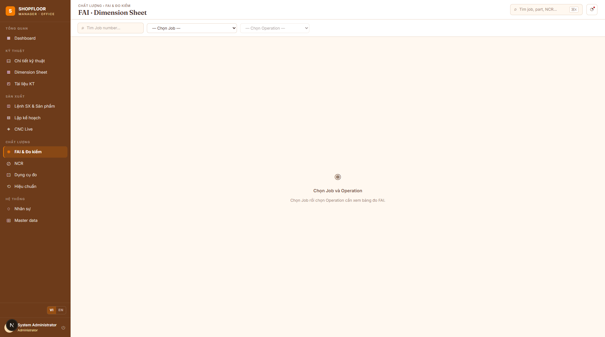

# FAI — First Article Inspection & Measurement

**Routes:** `/fai` · `/jobs/{id}/fai`  
**Roles:** All authenticated users (enter values: Operator, QC Inspector, Engineer)

---

## Overview

FAI (First Article Inspection) is the measurement tracking module. Every dimension defined on a `PartOp` must be measured for every product serial. Results are recorded as `MeasureValue` records — one per measurement event (full history preserved).



---

## `/fai` — Top-Level View

The standalone FAI view lets QC engineers browse any job/operation without navigating through the Jobs module.

### Workflow
1. Select a **Job** (search by job number or part number)
2. Select an **Operation** from the job's routing
3. The **measurement matrix** loads automatically

---

## Measurement Matrix

The FAI matrix is a table where:
- **Rows** = Product serials (001, 002, … RunQty)
- **Columns** = Dimensions (sorted by `BalloonSort`, then `BalloonNumber`)

Each cell shows the latest measured value for that `(serial × dimension)` combination:
- **Green** = Pass (`MinValue ≤ MeasuredValue ≤ MaxValue`)
- **Red** = Fail
- **Gray / empty** = Not yet measured

Column headers show:
- Balloon label (e.g. `Ø5`, `L2`)
- Nominal ± tolerance
- Category badge (`LIN`, `ANG`, `THD`, `GEO`, `SFC`)
- `★` marker if `IsFinal = true`

---

## Entering Measurements (Web)

Click any cell in the matrix to enter or update a measurement:
- **Numeric dimensions**: enter a value → Pass/Fail is calculated automatically against `MinValue`/`MaxValue`
- **Text dimensions** (`IsTextType = true`): select PASS or FAIL directly
- **Final dimensions** (`IsFinal = true`): only QC Inspector role can enter these

Each submission creates a **new `MeasureValue` record** — previous values are never overwritten. The matrix always shows the most recent measurement.

---

## Measurement Entry at the Machine (Desktop MES)

The Desktop WPF app provides a touch-optimized FAI entry screen at each CNC machine. See [Desktop MES documentation](desktop-mes.md) for details on the measurement workflow, NumPad input, and auto-advance behavior.

---

## Pass / Fail Rules

```
Numeric:  Pass  if  (Nominal − ToleranceMinus) ≤ Value ≤ (Nominal + TolerancePlus)
          Fail  otherwise

Text:     Pass / Fail set explicitly by operator (no numeric bounds)

Final:    Same rules but only QC Inspector can enter; Operators see the cell grayed out
```

---

## SPC — Statistical Process Control

`MathNet.Numerics` calculates process capability indices from measurement history per dimension:

| Index | Formula |
|---|---|
| **Cp** | `(USL − LSL) / (6σ)` |
| **Cpk** | `min((USL − x̄) / (3σ), (x̄ − LSL) / (3σ))` |

Where `USL = MaxValue`, `LSL = MinValue`, `x̄ = mean`, `σ = sample standard deviation`.

Results are available via `GET /api/v1/fai/spc?dimensionId=&jobId=`.

---

## API Endpoints

| Method | Path | Description |
|---|---|---|
| `GET` | `/api/v1/fai` | FAI sheet (`FaiSheetDto`) for a job+operation |
| `POST` | `/api/v1/fai/measure` | Submit a measurement value |
| `GET` | `/api/v1/fai/spc` | Cpk/Cp for a dimension |
| `GET` | `/api/v1/routing-revs/{id}/dimensions` | All dimensions for a routing rev (used by Dim Sheet) |
