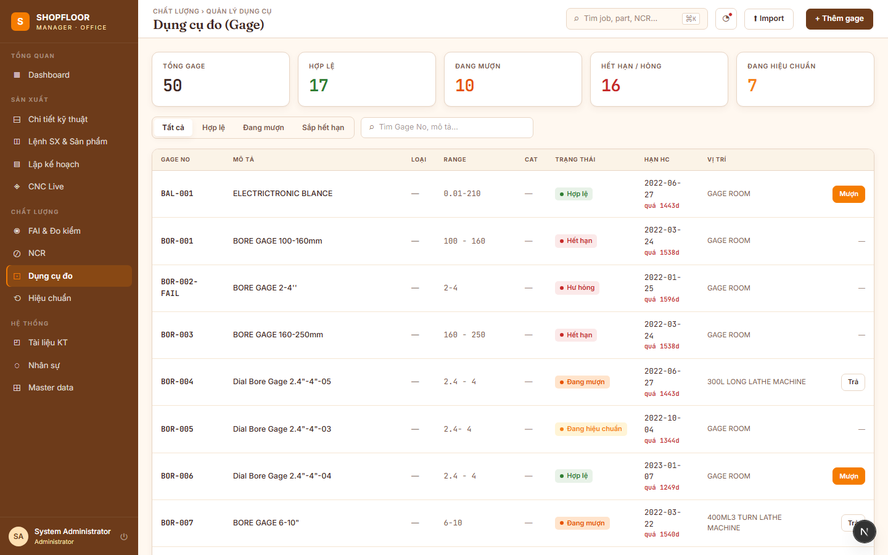

# Gage Management

**Route:** `/gages`  
**Roles:** All authenticated users (write: QC Inspector, Manager)

---

## Overview

Tracks the metrology equipment inventory — calipers, micrometers, bore gauges, CMM probes, thread gauges, and more — including borrow/return history and calibration due dates.

---

## KPI Strip (4 cards)

| KPI | Value |
|---|---|
| **Total Gages** | All instruments in the database |
| **Valid** | `IsValid = true` (calibration current) |
| **Borrowed** | Currently checked out |
| **Expiring Soon** | Due for calibration within 30 days |

---

## Gage List

### Filter tabs
- **All** — complete inventory
- **Valid** — calibration current
- **Borrowed** — currently checked out
- **Expiring** — due within 30 days / already overdue

### Gage table columns

| Column | Notes |
|---|---|
| Code | Gage serial / asset code |
| Name | Description |
| Type | Gage type (see below) |
| Location | Storage location / slot |
| Last calibration | Date of most recent calibration |
| Due date | `LastCalibration + CalibFrequencyDays` |
| Days remaining | Negative = overdue (red) |
| Status | `Valid` / `Expiring` / `Overdue` badge |
| Borrowed | Borrower name if checked out |

### Actions per row
- **Borrow** — record who is taking the gage and when
- **Return** — close an active borrow transaction

---

## Gage Types

Aligned to `GageCategory` for traceability (which gage type is valid for which dimension — `Dimension.GageTypeId → GageType.CategoryId → GageCategory`):

| Type | Category | Instrument |
|---|---|---|
| `CAL` | LIN | Caliper |
| `MIC` | LIN | Micrometer |
| `BOR` | LIN | Bore gauge |
| `DPG` | LIN | Depth gauge |
| `HEG` | LIN | Height gauge |
| `PLG` | THD | Thread plug gauge |
| `PDG` | THD | Thread pitch diameter gauge |
| `CMM` | GEO | CMM probe |
| `IND` | GEO | Indicator / dial gauge |
| `PPM` | GEO | Profile projector / measuring machine |
| `SRM` | SFC | Surface roughness meter |

---

## Borrow / Return

**Borrow** — creates a `BorrowTransaction` with:
- `GageId` + `BorrowedBy` (current user) + `BorrowedAt`
- `Status = Active`

**Return** — finds the active `BorrowTransaction` for that gage and sets:
- `ReturnedAt = now`
- `Status = Returned`

The gage's `IsBorrowed` field is updated accordingly.

---

## Computed Fields (not stored)

| Field | Calculation |
|---|---|
| `DueDate` | `LastCalibrationDate + CalibFrequencyDays` |
| `DaysRemaining` | `DueDate − today` (negative = overdue) |
| `IsValid` | `DaysRemaining > 0` |

---

## API Endpoints

| Method | Path | Description |
|---|---|---|
| `GET` | `/api/v1/gages` | List with filters (`statusCode`, `gageTypeId`, `isBorrowed`, `search`) |
| `POST` | `/api/v1/gages` | Create gage |
| `GET` | `/api/v1/gages/calib-due` | Gages due for calibration |
| `GET` | `/api/v1/gage-types` | Gage type reference list |
| `GET` | `/api/v1/gage-locations` | Location / slot reference list |
| `POST` | `/api/v1/borrow-transactions` | Borrow a gage |
| `GET` | `/api/v1/borrow-transactions` | List borrow history (filter by `gageId`, `status`) |
| `PUT` | `/api/v1/borrow-transactions/{id}/return` | Return a gage |
