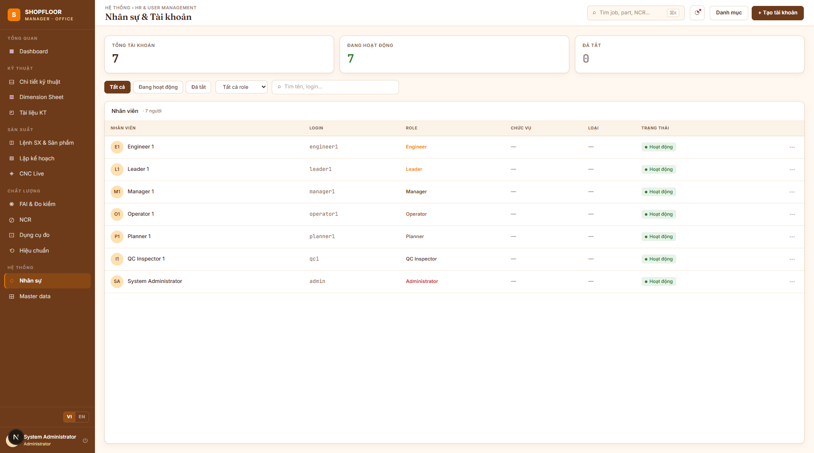

# HR & User Management

**Route:** `/hr`  
**Roles:** All users (view); Administrator (create/edit/deactivate)

---

## Overview

Manage employees, user accounts, roles, and organizational lookups (departments, positions, user types).

---

## User Table

| Column | Notes |
|---|---|
| Name | Full name |
| Login | Username (`userLogin`) |
| Department | Organizational unit |
| Position | Job title code |
| Role | System role (see below) |
| Status | Active / Inactive badge |
| Created | Date |
| ⋯ | Edit / Deactivate menu |

Search filters by name or username.

---

## Roles

| Role | Description |
|---|---|
| `Administrator` | Full system access + Desktop MES Settings |
| `Manager` | View all data, approve NCRs, manage users |
| `Engineer` | Create/edit Parts, Routings, Dimensions, upload documents |
| `QC Inspector` | Approve/reject TechDocs, enter FAI Final dims, close NCRs |
| `Leader` | Operator + force-finish another operator's session |
| `Operator` | Desktop MES: select Job/OP/Serial, enter measurements, file NCRs |
| `Planner` | View all production data, manage planning |

---

## Creating / Editing a User

Click **"+ Tạo tài khoản"** or the **"⋯ → Sửa"** menu.

| Field | Notes |
|---|---|
| Name | Full name (required) |
| Login | Username — must be unique |
| Password | Min 6 chars; hashed with bcrypt |
| Email | Optional; used for password-reset emails |
| Sex | Optional |
| Department | Organizational unit |
| Role | System role (required) |
| User Type | Employment type (full-time, part-time…) |
| Position | Job title |
| Work Status | Active / On leave / Resigned… |

---

## Deactivating a User

**"⋯ → Vô hiệu hoá"** sets `IsActive = false` (soft disable — account is hidden from most views but audit records are preserved). **"Kích hoạt"** reverses this.

Users are **never hard-deleted**.

---

## Password Reset

- **Web App** — `POST /api/v1/auth/forgot-password` sends a reset link via MailKit.
- **Administrator** — can set a new password directly via `PUT /api/v1/users/{id}` (with new password field).
- **`FirstLogin = true`** — web app prompts user to change password on first login. Desktop MES skips this check.

---

## Organizational Lookups

Managed via **"Danh mục"** button (Administrator):

| Lookup | Managed by |
|---|---|
| Departments | Create + rename inline |
| Positions | Create (no edit API yet) |

---

## API Endpoints

| Method | Path | Description |
|---|---|---|
| `GET` | `/api/v1/users` | Paginated user list |
| `POST` | `/api/v1/users` | Create user |
| `PUT` | `/api/v1/users/{id}` | Update user (includes deactivate via `isActive`) |
| `GET` | `/api/v1/roles` | Role list |
| `GET` | `/api/v1/departments` | Department list |
| `POST` | `/api/v1/departments` | Create department |
| `PUT` | `/api/v1/departments/{id}` | Rename department |
| `GET` | `/api/v1/positions` | Position list |
| `POST` | `/api/v1/positions` | Create position |
| `GET` | `/api/v1/user-types` | User type list |
| `GET` | `/api/v1/work-statuses` | Work status list |
| `POST` | `/api/v1/auth/login` | JWT login |
| `POST` | `/api/v1/auth/forgot-password` | Send reset email |
| `POST` | `/api/v1/auth/reset-password` | Apply reset token |
