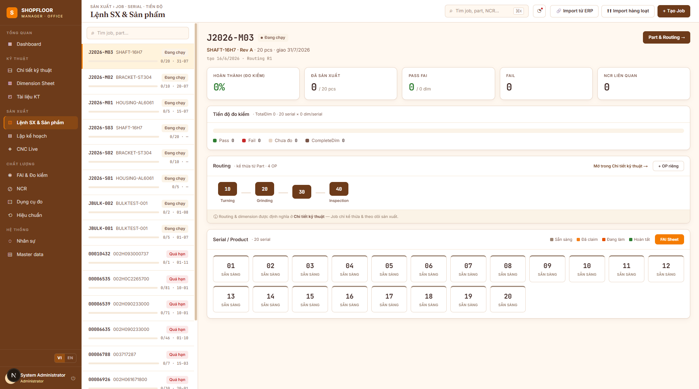
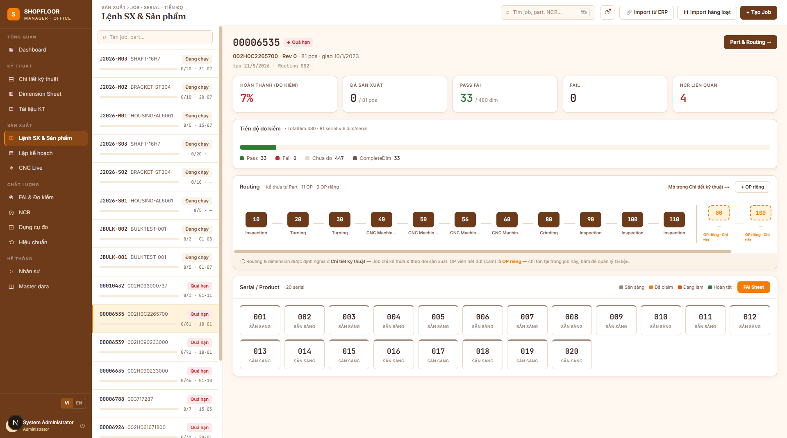
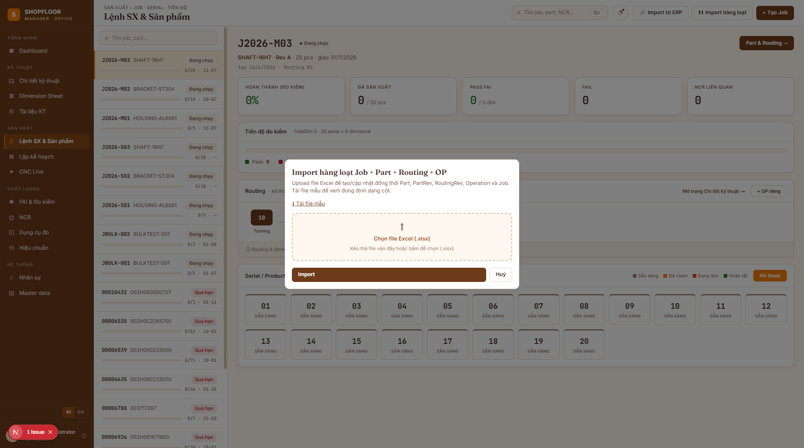
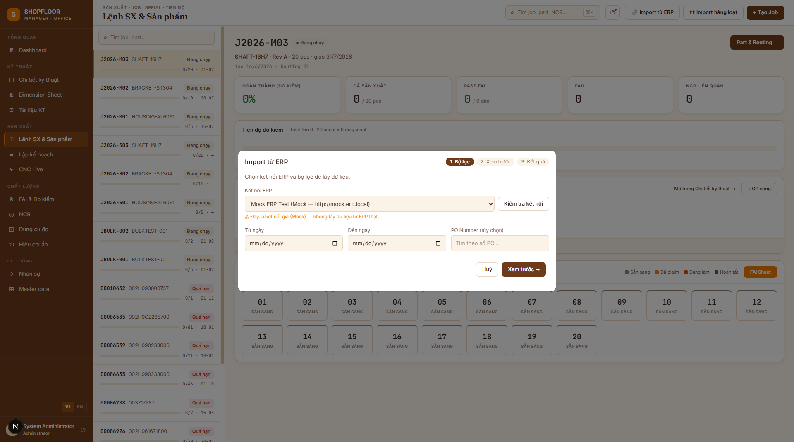
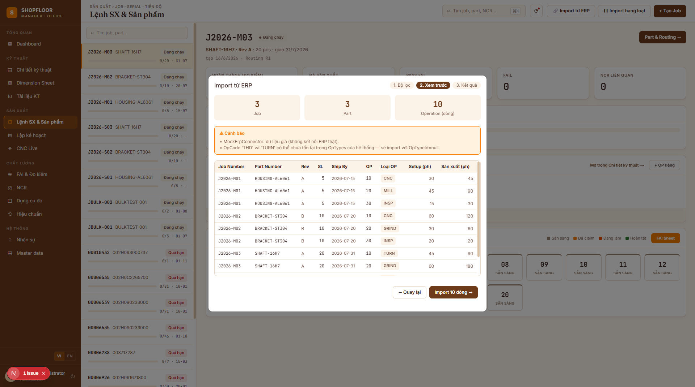

# Production Management — Jobs & Serials

**Route:** `/jobs`  
**Roles:** All authenticated users (write: Manager, Engineer, Planner)

---

## Overview

The Jobs view is the central hub for tracking production orders. It uses a **master-detail** layout: a scrollable job list on the left and a full detail panel on the right.

---

## Job List (left panel)

Each row shows:
- **Job number** (monospace) + status badge (`Running` / `Overdue` / `At Risk` / `Complete`)
- Part number · Revision code
- Quantity · Ship-by date
- Red badge when overdue

A search box filters by job number, part number, or customer PO in real time.

---

## Job Detail (right panel)

### Header
- Job number (large mono) + status badge
- Part number + revision → links to `/parts/{id}/operations`
- Run quantity, ship-by date, routing revision code
- Button **"Part & Routing →"** navigates to the part's engineering detail

### KPI Strip (5 cards)
| KPI | Description |
|---|---|
| **% Complete** | `completeDim / totalDim × 100` — measurement progress |
| **Produced** | Products created vs run quantity |
| **Pass FAI** | `passDim / totalDim` |
| **Fail** | Highlighted red when > 0 |
| **NCR** | Open NCRs linked to this job — red when > 0 |

### Inspection Progress Card
Stacked bar chart: **Pass** (green) / **Fail** (red) / **Not measured** (gray) over `totalDim`.

### Routing (reference) Card
Horizontal OP strip showing the inherited routing:
- Solid boxes = template OPs from `RoutingRev`
- **Dashed orange boxes** = job-specific OPs (`ForJobOnly = true`) — click to open `/jobs/{id}/operations?opId=...`
- Footer note: "Routing & dimensions are defined in Engineering — the job only inherits and tracks production"

### Serial / Product Grid
Color-coded cards for every serial number:
| Color | State | Meaning |
|---|---|---|
| Gray | Available | Ready to select at Desktop MES |
| Amber | Claimed | Operator has selected this serial |
| Green (active) | In Progress | Session running on a CNC machine |
| Green (ok) | Complete | FAI finished |

Click **"FAI Sheet"** to view the measurement matrix for any serial.

---

## Creating a Job

Click **"+ Tạo Job"** (or **"+ New Job"** in English) in the topbar.

Required fields:
- `Job Number` — business key (e.g. `J2026-001`), must be unique
- `Part Rev ID` — selects which part revision this job produces
- `Routing Rev ID` — selects which routing revision to use (snapshot)
- `Run Qty` — number of serials to produce
- `Ship By` — target delivery date

On submit, the API auto-generates `Product` records for serials `001` → `RunQty`.

---

## Bulk Excel Import

Import multiple jobs, parts, and routings from a single Excel file.

Click **"⬆⬆ Import hàng loạt"** in the topbar. Download the Excel template first (button inside the dialog).

### Excel columns (row 1 = header, case-insensitive)

| Column | Required | Notes |
|---|---|---|
| `PartNumber` | ✅ | Creates the part if it does not exist |
| `PartDescription` | | |
| `Revision` | ✅ | New revision → deactivates previous revisions |
| `JobNumber` | ✅ | Creates or updates the job |
| `PONumber` | | |
| `POLine` | | |
| `RunQty` | | Increase → creates additional serials; decrease → warning, no deletion |
| `ShipBy` | | `YYYY-MM-DD` |
| `OpNumber` | ✅ | Upserted into the active RoutingRev |
| `OpType` | | Must match an existing OpType code (e.g. `CNC`, `GRIND`) |
| `OpDescription` | | |
| `SetupTime` | | Minutes |
| `ProdTime` | | Minutes |

### Import result
7 counters are shown after import: Parts Created, Part Revisions Created, Operations Created, Operations Updated, Jobs Created, Jobs Updated, Products Created — plus a row-level error list.

### Import rules
- Same `JobNumber` in multiple rows → all rows belong to that job
- Each group is transactional: one row error → that job is skipped, others continue
- `OpType` not found → warning + `OpTypeId = null`; import still proceeds

---

## ERP Integration

Import jobs directly from an ERP system (Epicor or Mock) without an Excel file.

Click **"🔗 Import từ ERP"** / **"🔗 Import from ERP"** in the topbar. A 3-step dialog opens:

### Step 1 — Filter
- Select an ERP connection (configured by Administrator)
- **Test Connection** button verifies the link in real time
- Optional filters: Date From / Date To / PO Number

### Step 2 — Preview
- **3 KPIs**: distinct Jobs / Parts / Operations to be imported
- **Warnings banner** (orange): unknown OpType codes, Mock connector notice, etc.
- **Preview table** (9 columns): Job, Part, Rev, Qty, Ship By, OP, Op Type, Setup, Prod time

### Step 3 — Result
- 7 counter cards (accent color when > 0)
- Row-level error list for any skipped rows

### Supported connectors

| Type | Protocol | Authentication |
|---|---|---|
| `Mock` | In-memory hardcoded data | None (test only) |
| `Epicor` | OData v4 (`/api/v1/Erp.BO.JobEntrySvc/`) | HTTP Basic (Base64) |

> Connections are managed via `POST /api/v1/erp/connections` (Administrator role required). Credentials are stored in the `erp_connections` table.

---

## API Endpoints

| Method | Path | Description |
|---|---|---|
| `GET` | `/api/v1/jobs` | Paginated job list with filters |
| `POST` | `/api/v1/jobs` | Create job + auto-generate products |
| `GET` | `/api/v1/jobs/{id}` | Job detail + operations |
| `GET` | `/api/v1/jobs/{id}/progress` | `JobProgressDto` — dim counts for KPI |
| `GET` | `/api/v1/jobs/{id}/products` | Product list with session status |
| `POST` | `/api/v1/jobs/import-batch` | Bulk import from Excel |
| `GET` | `/api/v1/jobs/import-batch/template` | Download Excel template |
| `GET` | `/api/v1/erp/connections` | List ERP connections |
| `POST` | `/api/v1/erp/connections` | Create ERP connection (Admin) |
| `POST` | `/api/v1/erp/connections/{id}/test` | Test ERP connectivity |
| `POST` | `/api/v1/erp/preview` | Preview rows from ERP |
| `POST` | `/api/v1/erp/import` | Import from ERP |
