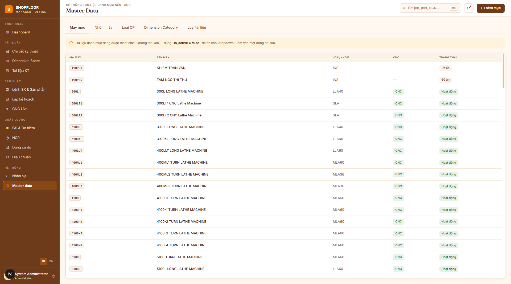

# Master Data

**Route:** `/master`  
**Roles:** All users (view); Administrator (create/edit)

---

## Overview

Central management of system-wide lookup tables: machines, machine groups, operation types, dimension categories, and document types.

---

## Tabs

### Machines

| Field | Notes |
|---|---|
| Code | Unique machine identifier (e.g. `CNC-LINE1-01`) |
| Name | Display name (e.g. `MAZAK QTN-350 #1`) |
| Machine Group | Capability group (e.g. `CNC Turning`) |
| Serial Number | Asset serial |
| Active | Shown in machine-selection dropdowns |

The `MachineCode` from `local.json` on each Desktop MES PC must match a code in this table.

### Machine Groups

Groups machines by process capability:
- `CNC Machining`
- `CNC Turning`
- `Grinding`
- `Heat Treatment`
- …

Used by planners to assign jobs to capability groups.

### Operation Types (OpTypes)

Operation type codes referenced in OP definitions and Excel imports:

| Code | Description |
|---|---|
| `CNC` | CNC Machining |
| `TURN` | Turning |
| `GRIND` | Grinding |
| `INSP` | Inspection |
| `THD` | Threading |
| `HTR` | Heat Treatment |
| … | |

When importing OPs from Excel or ERP, `OpType` is matched by code (case-insensitive). Unrecognized codes → warning + `OpTypeId = null`.

### Dimension Categories

| Code | Color | Used for |
|---|---|---|
| `LIN` | Brown | Linear dimensions (lengths, diameters) |
| `ANG` | Orange | Angular dimensions |
| `THD` | Tan | Thread callouts |
| `GEO` | Dark brown | Geometric tolerances (flatness, roundness…) |
| `SFC` | Medium brown | Surface finish (Ra, Rz…) |

### Document Types (FileTypes)

Controls which document types appear in upload dialogs and filters:

| Code | Level | Description |
|---|---|---|
| `DRW` | Part | 2D Drawing |
| `CAD` | Part | 3D CAD |
| `GCD` | OP | G-code program |
| `TLS` | OP | Tool list |
| `CAM` | OP | CAM source |
| `THD` | OP | Thread inspection sheet |
| `RTC` | Job OP | Route card |
| `FXT` | Job OP | Fixture drawing |

---

## CRUD Operations

Click **"+ Thêm mục"** to create a new item, or click any row to edit it. A single dialog (`MasterItemDialog`) handles all 5 tabs — fields adapt per `kind`.

All items have an **Active** toggle. Inactive items are hidden from selection dropdowns but preserved for historical data integrity.

---

## API Endpoints

| Method | Path | Description |
|---|---|---|
| `GET` | `/api/v1/machines` | Machine list (`activeOnly` param) |
| `POST` | `/api/v1/machines` | Create machine |
| `PUT` | `/api/v1/machines/{id}` | Update machine |
| `GET` | `/api/v1/machine-groups` | Machine group list |
| `POST` | `/api/v1/machine-groups` | Create group |
| `PUT` | `/api/v1/machine-groups/{id}` | Update group |
| `GET` | `/api/v1/op-types` | Op type list |
| `POST` | `/api/v1/op-types` | Create op type |
| `PUT` | `/api/v1/op-types/{id}` | Update op type |
| `GET` | `/api/v1/dimension-categories` | Category list |
| `POST` | `/api/v1/dimension-categories` | Create category |
| `PUT` | `/api/v1/dimension-categories/{id}` | Update category |
| `GET` | `/api/v1/tech-documents/file-types` | Document type list |
| `POST` | `/api/v1/tech-documents/file-types` | Create document type |
| `PUT` | `/api/v1/tech-documents/file-types/{id}` | Update document type |
