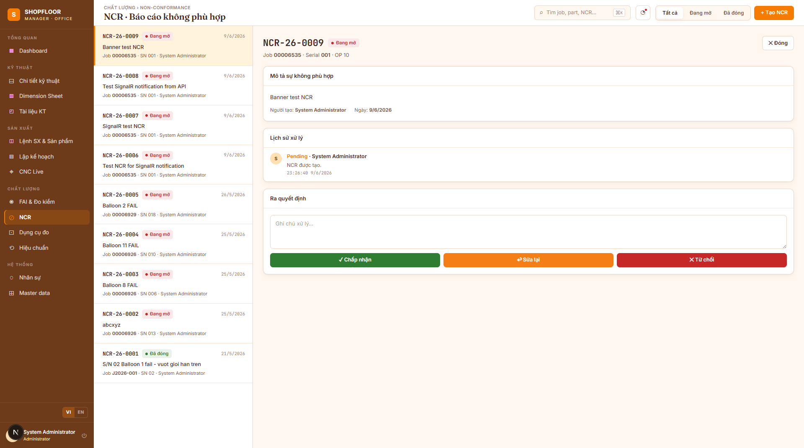

# NCR — Non-Conformance Reports

**Route:** `/ncrs`  
**Roles:** All authenticated users (create: all; disposition: QC Inspector, Manager)

---

## Overview

Non-Conformance Reports (NCRs) capture and track defects found during production or inspection.



---

## NCR Number Format

NCRs are assigned a sequential number on creation:

```
NCR-{YY}-{NNNN}
```

Examples: `NCR-26-0001`, `NCR-26-0042`. Numbers are never recycled.

---

## NCR List View

Searchable and filterable list of all NCRs:

| Column | Notes |
|---|---|
| NCR Number | Auto-generated on creation |
| Job | Linked production job |
| Serial | Product serial number |
| Operation | Which OP was affected |
| Reason | From seeded reason list |
| Department | `PROD` / `QC` / `ENG` |
| Status | `Open` / `Closed` |
| Action | `Pending` / `Approved` / `Rework` / `Rejected` |
| Created | Date + user |

---

## Creating an NCR

NCRs can be created from two places:

1. **Web App** — click **"+ Tạo NCR"** on the NCR list page
2. **Desktop MES** — NCR dialog opens automatically when a FAI measurement fails

**Required fields:**
- Job, Product (serial), PartOp
- Reason — selected from 15 seeded categories:

| Reason | Department |
|---|---|
| Tool wear | PROD |
| Setup error | PROD |
| Operator error | PROD |
| Machine malfunction | PROD |
| Coolant issue | PROD |
| Material handling | PROD |
| Programming error | ENG |
| Drawing error | ENG |
| Design issue | ENG |
| Fixture problem | ENG |
| Process parameter | ENG |
| Measurement error | QC |
| Calibration issue | QC |
| Inspection method | QC |
| Other (requires description) | — |

**Optional:** free-text description (required when reason = "Other").

---

## Disposition Workflow

```
         Created
            │
            ▼
         Pending ──── QC Inspector / Manager disposition ────►
         │                                                     │
         ├──► Approved   (use as-is, no rework needed)        │
         │                                                     │
         ├──► Rework     (return for correction)              │
         │       └──► Re-inspect → if Pass → Closed           │
         │                                                     │
         └──► Rejected   (scrap)                              │
                 └──────────────────────────── Closed ◄───────┘
```

Every disposition change is stored in `AuditLog` with timestamp and user.

---

## Real-time Notifications

When an NCR is created via the Desktop MES (at machine), QC Inspectors receive a **real-time push notification via SignalR**:
- A red banner appears at the top of the Desktop MES Dashboard for 8 seconds
- Web App QC users see an updated badge count

---

## API Endpoints

| Method | Path | Description |
|---|---|---|
| `GET` | `/api/v1/ncrs` | Paginated list with filters |
| `POST` | `/api/v1/ncrs` | Create NCR |
| `GET` | `/api/v1/ncrs/{id}` | NCR detail |
| `PUT` | `/api/v1/ncrs/{id}/action` | Set disposition (Approve/Rework/Reject) |
| `GET` | `/api/v1/ncr-reasons` | List reason categories |
