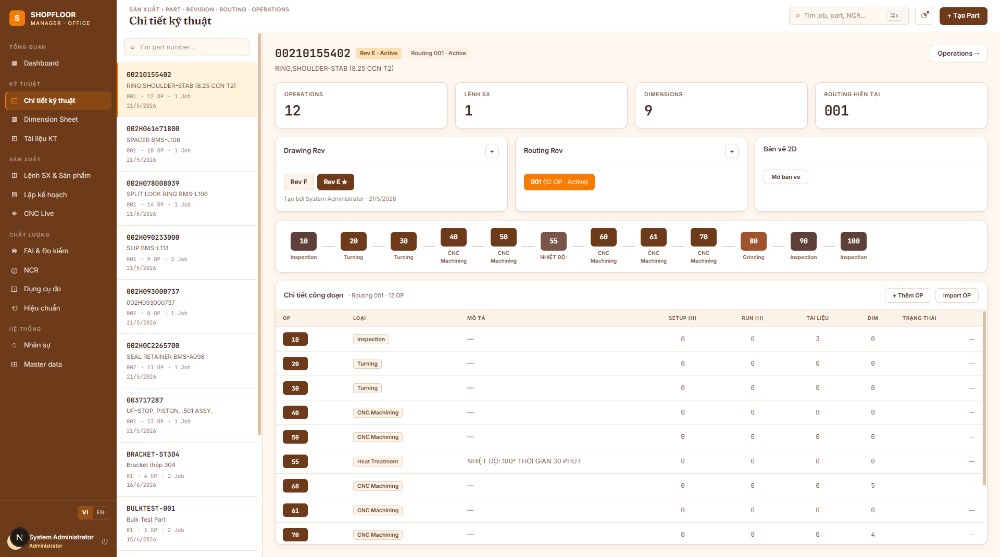
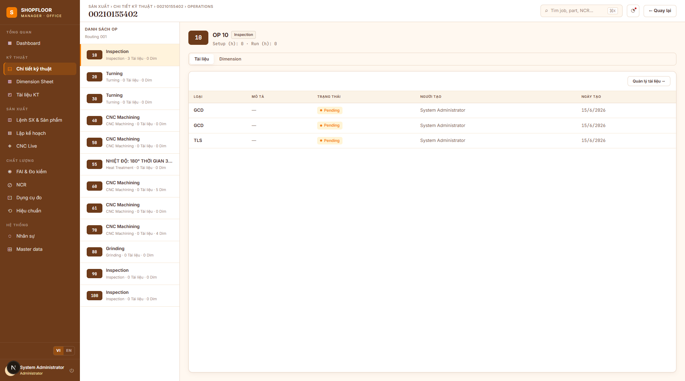

# Parts & Routing — Engineering Reference

**Routes:** `/parts` · `/parts/{id}/operations`  
**Roles:** All authenticated users (write: Engineer, Manager)

---

## Overview

The Engineering section manages the technical master data that all production orders inherit: **part catalog**, **design revisions**, **manufacturing routings**, and **operation sequences**.



---

## `/parts` — Part Catalog

### Left panel — Part list
- Part number (monospace) + description
- Active revision code + routing code
- Operation count · job count

Search filters by part number or description in real time.

### Right panel — Part detail

**KPI strip (4 cards):**
| KPI | Value |
|---|---|
| Operations | Total OPs in active routing |
| Jobs | Jobs referencing this part |
| Dimensions | Total dimensions across all OPs |
| Current Routing | Active routing revision code |

**Drawing Rev card** — lists all part revisions (Rev A, B, C…). Active revision is highlighted. Click **"Bản vẽ 2D / CAD →"** to open technical documents filtered to that revision.

**Routing Rev card** — lists all routing revisions. Each shows its code (R1, R2…), OP count, and active status. Click a revision to switch the OP table below.

**Operations table** — shows all `PartOp` records for the selected `RoutingRev`:
| Column | Notes |
|---|---|
| OP Number | e.g. 10, 20, 30 |
| Type | CNC Machining, Turning, Grinding… |
| Description | |
| Setup | Minutes |
| Prod | Minutes |
| Docs | Count of approved TechDocuments |
| Dim | Count of dimensions |

Click any OP row → navigates to `/parts/{id}/operations?routingRevId=...&opId=...`.

### Adding revisions

| Button | Action |
|---|---|
| **+ Drawing Rev** | Creates a new `PartRev`; auto-creates Routing + RoutingRev R1 |
| **+ Routing Rev** | Copies all OPs from current active rev into a new rev |
| **+ OP** | Adds a new `PartOp` to the active `RoutingRev` |

### Excel import — Operations
Click **"⤓ Ops"** in the operations table header to import OPs from Excel. Upserts by `OpNumber` — existing OPs are updated (description / times), new ones are created. Dimensions and documents are not touched.

---

## `/parts/{id}/operations` — Operation Detail



### Left panel — OP list
Lists all operations in the selected `RoutingRev`. Click to select.

Selected OP shows:
- OP number badge + op type + Done status
- Setup / production time

### Right panel — OP tabs

#### Tab: Documents
Table of `TechDocuments` attached to this OP:

| Column | Notes |
|---|---|
| File name | Link to download (pre-signed MinIO URL) |
| Type | `GCD` / `TLS` / `CAM` / `THD` |
| Status | `Pending` / `Approved` / `Rejected` badge |
| Uploaded by | User name |
| Size | File size in B / KB / MB |

Button **"Manage Documents →"** opens `/documents?partOpId=...` filtered to this OP.

#### Tab: Dimensions
Full dimension table for this OP:

| Column | Notes |
|---|---|
| Balloon | e.g. `Ø5`, `L2`, `Ra3` |
| Category | `LIN` / `ANG` / `THD` / `GEO` / `SFC` |
| Nominal | `DECIMAL(14,4)` |
| Tol + | Upper tolerance (always positive) |
| Tol − | Lower tolerance (always positive) |
| Max | `Nominal + TolerancePlus` |
| Min | `Nominal − ToleranceMinus` |
| Unit | mm (default) |
| Final | Bullet if `IsFinal = true` |

Click **"✎"** to inline-edit Nominal / Tol+ / Tol−; Max and Min update in real time before saving.

Button **"⤓ Dims"** imports dimensions from Excel.

---

## Excel import — Dimensions

**Endpoint:** `POST /api/v1/operations/{opId}/dimensions/import`

Columns (header case-insensitive):

| Column aliases | Required | Notes |
|---|---|---|
| `BalloonNumber` / `Balloon` | ✅ | Skip if already exists in this OP |
| `Code` | | Internal code |
| `Description` | | |
| `Nominal` | | Numeric → dimension with Tol+/Tol− fields; non-numeric → `IsTextType = true` |
| `TolPlus` / `Tol+` | | |
| `TolMinus` / `Tol-` | | |
| `Unit` | | Default `mm` |
| `Category` | | `LIN` / `ANG` / `THD` / `GEO` / `SFC` |

---

## Core Design Rules

```
PartNumber
  └─ PartRev (Rev A, B, C…)          — one IsActive per PartNumber
       └─ Routing
            └─ RoutingRev (R1, R2…) — one IsActive per Routing
                 └─ PartOp (OP 10, 20, 30…)
                       └─ Dimension
```

- **No logic in the database.** All validation and mutation is in C# handlers.
- A `Job` stores a **snapshot** of `PartRevId + RoutingRevId` at creation. Subsequent revision changes do not affect in-progress jobs.
- `ForJobOnly = true` OPs exist only in one job; they do not belong to any `RoutingRev`.

---

## API Endpoints

| Method | Path | Description |
|---|---|---|
| `GET` | `/api/v1/parts` | Paginated part list |
| `POST` | `/api/v1/parts` | Create part |
| `GET` | `/api/v1/parts/{id}/revisions` | List all `PartRev` for a part |
| `POST` | `/api/v1/parts/{id}/revisions` | Add new `PartRev` |
| `GET` | `/api/v1/parts/{id}/routing-revs` | List all `RoutingRev` for active revision |
| `POST` | `/api/v1/parts/routing-revs` | Create new `RoutingRev` (copies OPs) |
| `GET` | `/api/v1/operations` | List OPs (filter by `routingRevId` or `jobId`) |
| `POST` | `/api/v1/operations` | Create OP |
| `POST` | `/api/v1/operations/import` | Bulk import OPs from Excel |
| `GET` | `/api/v1/operations/{id}/dimensions/definitions` | List dimensions |
| `POST` | `/api/v1/operations/{id}/dimensions/import` | Import dimensions from Excel |
| `PUT` | `/api/v1/dimensions/{id}` | Update dimension tolerances |
