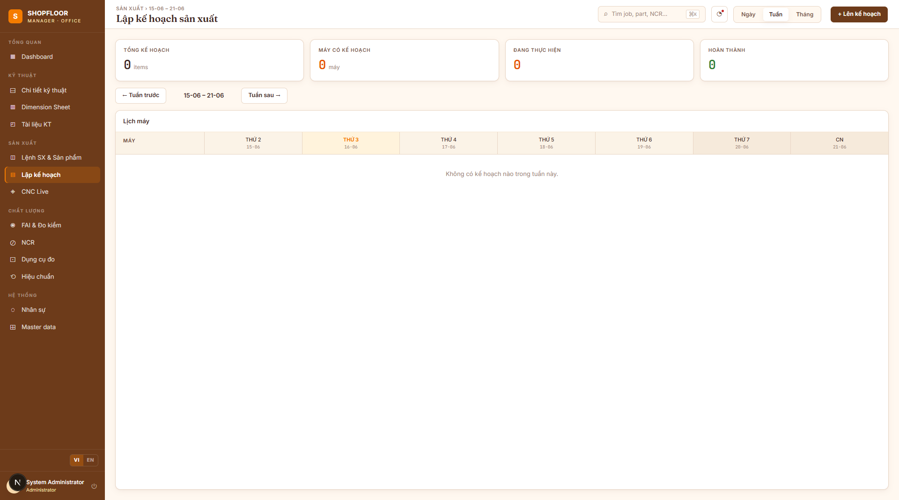

# Production Planning

**Route:** `/planning`  
**Roles:** Planner, Manager, Administrator  
**Status:** UI scaffold complete — API integration planned for Phase 5

---

## Overview

Weekly Gantt chart view for scheduling production jobs across machines.



---

## Planned Features (Phase 5)

- **Weekly Gantt** — drag-and-drop job blocks per machine, per shift
- **Capacity view** — machine loading percentage by day
- **Conflict detection** — warn when a machine is double-booked
- **Shift management** — define regular / overtime / weekend shifts
- **Export** — weekly plan to PDF or Excel

---

## Data Model (planned)

```
Shift
  └─ ShiftDay (Mon/Tue/…/Sun)
        └─ ShiftSlot (start time, end time)

PlanEntry
  ├─ JobId
  ├─ PartOpId
  ├─ MachineId
  ├─ PlannedStart
  └─ PlannedEnd
```

`PlanEntry` links a Job's operation to a machine and time window. Multiple plan entries per Job (one per OP per machine).

---

## Roadmap

This view currently shows placeholder mock data. Full implementation is scheduled as part of **Phase 5 — Advanced**.
